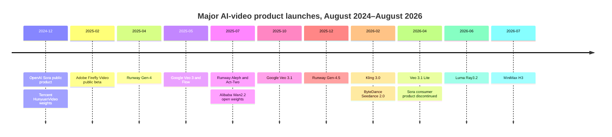
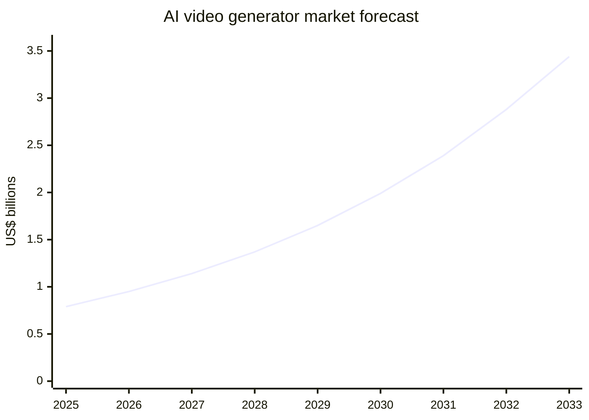

# State of AI Video Generation Tools

## Executive summary

AI video generation has moved from short, visually impressive demonstrations to a fragmented but increasingly production-capable market. The leading systems now support combinations of text-to-video, image-to-video, reference-guided generation, video transformation, motion transfer, multi-shot storyboarding and synchronised speech, music and sound effects. Yet no single product reliably replaces an end-to-end production pipeline: professional users still combine generation with reference images, repeated sampling, editing, compositing, colour grading, sound design and rights review.

The competitive landscape is dividing into three layers. **Frontier video-model developers**—Google, Runway, Luma, Kuaishou, ByteDance and MiniMax—compete on visual quality, motion, audiovisual synchronisation, consistency and controllability. **Workflow and distribution platforms**, especially Adobe, Runway and increasingly Luma, aggregate multiple models and embed them in editing environments. **Avatar and communications platforms**, led by Synthesia and HeyGen, sell completed business outcomes—training, localisation, sales enablement and marketing—rather than raw model access. Open-weight projects such as Alibaba’s Wan, Tencent’s HunyuanVideo and Lightricks’ LTX are rapidly compressing model-level differentiation, although “open” licences can contain material geographical or commercial restrictions. citeturn14view8turn14view9turn14view10

The strongest evidence of product-market fit is not necessarily in cinematic generation. Kuaishou reported Kling AI reaching a US$240 million annualised revenue run-rate in December 2025; HeyGen reported more than US$200 million ARR in June 2026; and Synthesia raised at a US$4 billion valuation in January 2026. These figures suggest that repeatable enterprise communications and high-volume commercial content currently monetise more predictably than speculative “AI film studio” use cases. citeturn13view5turn13view6turn13view7

Direct inference prices have fallen to roughly **US$0.03–US$0.40 per generated second**, depending on model, resolution, speed and audio. However, generation fees are rarely the main cost in a serious deployment. Iteration ratios, human review, editing, brand controls, integration, storage and legal governance can raise total annual ownership costs to approximately **US$23,000–US$55,000 for a small production team** and **US$0.9 million–US$3.1 million for a large enterprise programme**, under the workload assumptions used in this report. citeturn13view1turn13view2

The most important strategic development is that raw model quality is becoming less defensible. Sustainable advantages are shifting towards distribution, proprietary workflow data, controllability, identity and brand consistency, rights-cleared training data, provenance, enterprise security and integration with established creative systems. OpenAI’s discontinuation of the Sora consumer product in April 2026—despite releasing Sora 2 only months earlier—illustrates that benchmark visibility and public attention do not guarantee a durable product or distribution strategy. citeturn15view0turn13view0

## Competitive landscape

Commercial vendors generally disclose product capabilities but not detailed architectures. Descriptions such as “proprietary multimodal foundation model” are therefore more accurate than assuming every system uses a conventional diffusion architecture. The open ecosystem is more transparent: most leading downloadable models use latent-video diffusion or diffusion-transformer variants, often with model distillation, quantisation and mixture-of-experts techniques.

| Company or project | Headquarters; founded | Core technology and flagship products | Major releases and partnerships during the past 24 months |
|---|---|---|---|
| **OpenAI — Sora** | San Francisco; 2015 | Proprietary text/image-to-video and audiovisual world-simulation model; Sora 2 | Sora 2 added synchronised audio and improved physical-world modelling in September 2025. The web and app products were discontinued on 26 April 2026; the API is scheduled to close on 24 September 2026. citeturn15view0turn13view0 |
| **Google DeepMind — Veo and Flow** | London/Mountain View; DeepMind founded 2010 | Proprietary text/image-to-video, reference conditioning, extension and native audiovisual generation; Veo 3.1, Veo 3.1 Lite and Flow | Veo 3 introduced native dialogue, effects and ambient audio in May 2025; Veo 3.1 added richer audio, realism and narrative controls in October 2025. Flow provides a filmmaking workspace around the models. citeturn15view1turn15view2 |
| **Runway** | New York; 2018 | Proprietary video foundation models, image-to-video, video-to-video, motion transfer and editing; Gen-4.5, Aleph and Act-Two | Gen-4 launched in April 2025; Aleph and Act-Two added generative editing and performance capture; Gen-4.5 followed in December. Runway also aggregates third-party models and has a custom-model partnership with Lionsgate. citeturn15view3turn15view4turn14view0 |
| **Luma AI** | Redwood City, California; 2021 | Multimodal “world-model” research; Ray3.2 video-to-video transformation and Luma creative platform | Ray3.2, released in June 2026, preserves source timing while allowing up to 64 art-directed keyframes, HDR and EXR export. Luma integrates Veo, Kling and Seedance models and partnered with HUMAIN on a planned 2-gigawatt Saudi AI supercluster. citeturn16view0turn16view1turn14view1 |
| **Kuaishou — Kling AI** | Beijing; 2011 | Proprietary multimodal visual-language architecture; text/image/reference-to-video, editing and digital humans | Kling 3.0 launched in February 2026 with native multilingual audio, multi-shot storyboards, reference consistency and clips of up to 15 seconds. Kling reached a reported US$240 million ARR in December 2025. citeturn14view5turn13view5 |
| **ByteDance — Seedance** | Beijing; 2012 | Proprietary multimodal text/image/audio/video-conditioned generation; Seedance 2.0 | Seedance 2.0 launched in China in February 2026 for film, advertising and commerce. Its planned international launch was subsequently put on hold after copyright disputes and demands for stronger safeguards. citeturn14view6turn16view3 |
| **MiniMax — Hailuo/H3** | Shanghai; 2022 | Multimodal generation, video editing and motion transfer; H3 | H3 launched in July 2026 with text, image, video and audio inputs, native stereo sound, up to 15-second 2K output and planned downloadable weights. MiniMax says its 2K generation costs less than one-third of mainstream rivals, although independent verification is unavailable. citeturn14view4 |
| **Adobe — Firefly** | San Jose; 1982 | Licensed-data video generation, generative extension, browser editing and Creative Cloud integration | Firefly Video entered public beta in February 2025. By April 2026, Firefly offered more than 30 models, including Adobe’s own model plus Veo 3.1, Runway Gen-4.5 and Kling 3.0, integrated with Firefly Video Editor and Premiere. citeturn14view7turn15view7 |
| **Pika** | Palo Alto; 2023 | Consumer-oriented text/image-to-video, transformations, effects and audio-driven facial performance; Pika 2.5 | Pika has emphasised fast, shareable effects and “Pikaffects” rather than full production pipelines. It raised US$80 million in June 2024 and offers developer access through partners including fal.ai. citeturn14view3turn2search20 |
| **Synthesia** | London; 2017 | Speech-driven avatar rendering, lip synchronisation, translation and template-based business video | The platform offers more than 240 avatars and 160-plus languages, targeting enterprise learning and communications. Product development has focused on collaboration, personal avatars, translation and corporate governance rather than cinematic generation. citeturn13view7turn16view6 |
| **HeyGen** | Los Angeles; 2020 | Avatar synthesis, voice cloning, lip sync, translation and agentic video assembly | Video Agent, publicly released in September 2025, automates scripting, visuals, voice-over, avatar selection and editing. Later releases expanded live avatars, workflow integrations and identity controls. citeturn15view6turn13view6 |
| **Alibaba — Wan2.2** | Hangzhou; Alibaba founded 1999 | Open-weight diffusion-model family for text-to-video, image-to-video, combined conditioning, audio-driven video and character animation | Model weights and inference code were released in July 2025 and integrated into Diffusers and ComfyUI; speech-to-video and character-animation variants followed. citeturn14view8 |
| **Tencent — HunyuanVideo** | Shenzhen; Tencent founded 1998 | Open-weight latent-video foundation models, image-to-video, custom subject generation and audio-driven avatars | HunyuanVideo weights arrived in December 2024; image-to-video, customised generation, avatars and the more efficient HunyuanVideo-1.5 followed during 2025. Some Hunyuan licences restrict use in the EU, UK and South Korea, so it is better classified as open-weight than unconditionally open-source. citeturn14view9turn3search13 |
| **Lightricks — LTX** | Jerusalem; 2013 | Open-weight latent diffusion, distilled inference, LoRA adaptation and depth/pose/edge controls | LTX-Video’s July 2025 releases included 2-billion- and 13-billion-parameter distilled models, up to 60-second workflows and control models. LTX-2 subsequently combined audio and video generation, multi-keyframes and higher-resolution output. citeturn14view10 |

The product-launch cadence shows how quickly the centre of competition has shifted from basic text-to-video towards audiovisual generation, editing and controllable multi-shot workflows.

## Users, workflows and adoption barriers

The market serves several overlapping user groups. Film and television users employ generation primarily for concept work, storyboards, previsualisation, synthetic plates, effects exploration, background replacement and low-risk inserts—not usually complete final productions. Advertising agencies and e-commerce teams generate product variants, social advertisements, regional adaptations and speculative pitches. Social creators optimise for speed, novelty and platform-native formats. Game and animation teams use motion transfer, character studies, environment concepts and cinematic prototyping. Enterprise users concentrate on training, onboarding, sales enablement, internal communications and multilingual localisation, where avatar platforms provide more predictable output than free-form cinematic models.

A typical professional workflow is:

1. A script, shot list or campaign brief is converted into storyboards, reference frames and brand constraints.
2. Teams generate numerous short candidates—often five to fifteen seconds each—using text, images, keyframes or source footage.
3. Candidates are selected, extended, restyled or regenerated with character, camera, motion and composition controls.
4. Outputs are assembled in Premiere, After Effects, Resolve, Nuke or browser-based editors; dialogue, sound, colour and compositing are corrected.
5. Humans review identity rights, trademarks, copyrighted elements, factual claims and provenance before publication.

This workflow is increasingly being internalised by platforms. Runway now offers node-based multi-model workflows; Adobe combines generation, stock assets, a multitrack editor and Premiere transfer; Luma’s Ray3.2 is explicitly designed around source footage, art-directed keyframes and finishing formats; and HeyGen’s Video Agent automates business-video assembly. citeturn15view4turn15view7turn16view0turn15view6

The principal adoption barrier is not whether models can produce an impressive clip, but whether they can produce a **specific, repeatable and legally usable clip on demand**. Temporal drift, inconsistent faces and products, unreliable physics, malformed text, accidental scene changes and non-determinism create high rejection rates. Clips remain short relative to conventional scenes, and native sound can introduce dialogue or timing defects. Reference controls and video-to-video transformation reduce these problems but constrain creative freedom.

Organisational barriers are equally significant: unclear training-data provenance; likeness and voice consent; security review; regional model availability; inconsistent commercial-use terms; API latency and quotas; lack of project-level versioning; and the difficulty of preserving provenance metadata through editing and social distribution. Open-weight deployment adds GPU scheduling, quantisation, model-security and licence-compliance work. As a result, adoption is fastest where output requirements are structured and templated, such as localised training, product marketing and short-form advertising.

## Economics and total cost of ownership

Pricing generally follows one of four models: consumer subscriptions with monthly credits; per-second or credit-based APIs; enterprise annual contracts with security and support; and self-hosted open weights, where licence fees may be zero but GPU and engineering costs remain.

Google’s current Vertex pricing ranges from **US$0.03 per second** for Veo 3.1 Lite without audio at 720p to **US$0.60 per second** for full Veo 3.1 audiovisual generation at 4K. Runway charges US$0.01 per credit: Gen-4 Turbo therefore costs US$0.05 per second, Gen-4.5 US$0.12, and some third-party or editing models considerably more. A ten-second generation can consequently cost from approximately US$0.30 to US$6 before retries, upscaling, audio work or editing. citeturn13view1turn13view2

Luma’s web plans range from US$9.99 for a non-commercial, watermarked tier to US$29.99 for commercial Plus and US$94.99 for an “Unlimited” tier with relaxed-mode generation; enterprise pricing is unspecified. Synthesia uses seat and usage tiers, with enterprise pricing unspecified and studio-grade custom avatars available as a US$1,000 annual add-on. Adobe, HeyGen, Pika and most enterprise vendors combine self-service subscriptions with negotiated contracts; exact volume discounts, service-level agreements and indemnification prices are generally unspecified. citeturn16view7turn16view6

Self-hosted models replace API charges with infrastructure costs. Public cloud and specialist GPU rates vary widely: a single H100 may be available near US$2 per hour on marketplace infrastructure, while hyperscaler configurations with networking and multiple H100s can cost tens of dollars per hour. Effective cost depends more on utilisation, batch size, model quantisation and engineering efficiency than on the advertised hourly rate. citeturn10search5turn10search14

### Estimated annual ownership cost

The following figures are analyst estimates, not vendor quotations. The small-business case assumes three creators, 20 finished minutes per month and eight generated minutes for every accepted minute. The enterprise case assumes 50 users, 500 finished minutes per month and a six-to-one generation-to-acceptance ratio.

| Cost component | Small business | Enterprise programme |
|---|---:|---:|
| Model subscriptions and API inference | US$5,800–US$13,800 | US$108,000–US$324,000 |
| Editing, asset management, storage and ancillary tools | US$2,000–US$6,000 | US$50,000–US$250,000 |
| Enterprise platform, SSO, support, contractual controls and indemnification | Usually included or minimal | US$100,000–US$500,000 |
| Human generation, editing and quality assurance | US$15,000–US$35,000 | US$400,000–US$1.3 million |
| MLOps, integration, security, procurement and legal governance | US$1,000–US$5,000 | US$200,000–US$750,000 |
| **Estimated total annual TCO** | **US$23,000–US$55,000** | **US$0.86 million–US$3.12 million** |

These estimates expose a common procurement error: comparing tools solely by price per generated second. A model that costs twice as much but cuts the rejection ratio from eight attempts to three, preserves brand assets and requires less compositing may have substantially lower total cost. Conversely, “unlimited” subscriptions commonly impose relaxed queues, fair-use restrictions or lower-priority compute and therefore do not imply unlimited production throughput.

## Strategy, funding and market structure

Frontier vendors use credits and APIs to acquire creators and developers, then pursue higher-margin enterprise contracts, custom models and production partnerships. Google can subsidise model adoption through Cloud, Gemini and YouTube distribution. Kuaishou and ByteDance can connect generation directly to enormous content, advertising and commerce ecosystems. Runway is building both proprietary models and an orchestration layer containing rival models. Luma’s strategy similarly combines its own Ray technology with external models while investing in longer-term world-model research.

Adobe’s position is structurally different. Its defensibility comes less from winning every model benchmark and more from controlling the professional workflow: Creative Cloud, Premiere, After Effects, Frame.io, Adobe Stock, enterprise procurement and Content Credentials. Its aggregation of Kling, Veo and Runway indicates that application-layer companies increasingly regard models as interchangeable suppliers. Adobe trains Firefly models on licensed and public-domain material rather than customer content and offers limited indemnification for eligible enterprise use, although trademark, publicity and privacy claims remain excluded. citeturn15view7turn16view4turn16view5

Synthesia and HeyGen pursue vertical SaaS economics. Their products combine avatars, scripts, voices, translation, templates, brand controls, collaboration and integrations. This produces recurring enterprise usage without requiring cinematic quality or open-ended prompt reliability. HeyGen reported more than 30 million users, use by 85% of the Fortune 100 and over US$200 million ARR in June 2026; these figures are company-reported and not independently audited. citeturn13view6

Open-weight developers use releases to attract researchers, cloud demand and ecosystem adoption. Alibaba benefits from ModelScope and cloud utilisation; Tencent extends its broader foundation-model ecosystem; Lightricks uses open models to create developer mindshare around its commercial platform. The strategic risk for proprietary vendors is that downloadable models may make adequate-quality generation cheap and locally deployable. The counterargument is that enterprise buyers value uptime, controls, indemnity and integration more than model ownership.

### Selected financing and disclosed revenue

| Organisation | Financing, investors or valuation | Revenue disclosure and primary source |
|---|---|---|
| **Runway** | US$308 million round in April 2025 led by General Atlantic, with SoftBank, Nvidia, Fidelity and Baillie Gifford; reported valuation above US$3 billion | Revenue unspecified; company planned further investment in film, animation and world simulators. citeturn14view0 |
| **Luma AI** | US$900 million Series C in November 2025 led by HUMAIN, with AMD Ventures, Andreessen Horowitz, Amplify and Matrix; reported valuation above US$4 billion | Revenue unspecified; financing tied to world-model development and a 2-gigawatt compute partnership. citeturn14view1turn8search5 |
| **Pika** | US$80 million financing announced in June 2024; total funding reported at roughly US$115–130 million; reported valuation estimates ranged from US$500–700 million | Revenue unspecified. citeturn14view3turn1search31 |
| **Synthesia** | US$180 million Series D at US$2.1 billion in January 2025, followed by a US$200 million Series E led by GV at US$4 billion in January 2026 | Reported ARR exceeded US$100 million in 2025; business model is subscription and enterprise SaaS. citeturn15view8turn13view7turn12search3 |
| **HeyGen** | US$60 million Series A led by Benchmark in 2024 at a valuation above US$500 million; Thrive, BOND and SV Angel participated | ARR rose from over US$35 million at the financing to a company-reported US$200 million-plus by June 2026. citeturn14view2turn13view6 |
| **MiniMax** | Hong Kong IPO in January 2026; approximately US$6.5 billion valuation at the upper end of the offer range | Listed-company disclosure is emerging; video-specific revenue remains unspecified. citeturn16view2turn14view4 |
| **Kuaishou/Kling** | Kuaishou is publicly listed in Hong Kong | Kling monthly revenue exceeded US$20 million in December 2025, equivalent to US$240 million ARR, according to Kuaishou’s investor-relations release. citeturn13view5 |

Funding is concentrating around compute-intensive “world-model” ambitions, but revenue evidence favours application-layer platforms. The emerging barbell is therefore capital-heavy frontier laboratories on one side and capital-efficient, workflow-specific SaaS on the other. Undifferentiated consumer generators between these poles face the greatest margin and retention pressure.

## Risks, regulation and compliance

The core misuse risks are impersonation, financial fraud, non-consensual intimate imagery, political manipulation, false evidence, copyrighted-character replication and unauthorised voice or likeness use. Native audio materially increases risk because a single model can now fabricate both visible behaviour and spoken claims. Reference-video and motion-transfer systems make replication easier even when a prohibited person’s name is not used.

The EU AI Act’s Article 50 transparency obligations became applicable on **2 August 2026**. Providers of generative systems must add machine-readable markings to generated or manipulated content, while deployers must disclose deepfakes and certain synthetic public-interest content. Because the rules apply across the value chain, an enterprise cannot assume that a vendor watermark alone satisfies its own publication duties. citeturn13view3

In the United States, the TAKE IT DOWN Act was signed on 19 May 2025, criminalising specified publication of non-consensual intimate imagery, including AI-generated material, and creating platform removal obligations. Other US rules remain fragmented across copyright, publicity rights, consumer protection, election law and state deepfake statutes rather than forming a single comprehensive AI-video regime. citeturn15view11turn9search23

Copyright remains commercially decisive and legally unsettled. Adobe differentiates through licensed and public-domain training data, customer-data exclusions and qualified enterprise indemnification. By contrast, ByteDance reportedly suspended Seedance 2.0’s international launch following studio allegations that it could reproduce protected characters and personalities. The incident shows that adding output filters after training may not resolve disputes over training inputs or a model’s learned representation of protected properties. citeturn16view4turn16view5turn16view3

Technical mitigations include prompt and output moderation, public-figure restrictions, identity verification, consent capture, invisible watermarking, signed provenance manifests and audit logs. Google’s SynthID embeds a watermark designed to survive cropping, filters, frame-rate changes and lossy compression. C2PA can record signed content origin and editing history, including live-video workflows. Neither mechanism proves that a depicted event is true: provenance demonstrates an asserted origin and history, and metadata can be lost when unsupported platforms re-encode media. citeturn15view9turn15view10

A robust enterprise control framework should therefore combine approved-model lists, documented rights to every reference asset, explicit avatar and voice consent, model-region licence mapping, output scanning, human editorial review, durable provenance, incident response and contractual restrictions on training with customer data.

## Market size, trends and outlook

Grand View Research estimates the narrowly defined global AI-video-generator market at **US$788.5 million in 2025**, **US$946.4 million in 2026** and **US$3.44 billion by 2033**, a 20.3% compound annual growth rate. It reports that large enterprises represented 62.2% of 2025 revenue and Asia-Pacific 31%. citeturn13view4

These estimates should be treated cautiously. A narrower market study forecasts approximately US$0.47 billion for generative AI in video creation in 2026, while broader generative-content markets are measured in tens of billions. Definitions differ over whether they include avatars, localisation, editing, APIs, services, advertising platforms and Chinese domestic revenue. citeturn5search0turn5search4

There is a conspicuous bottom-up inconsistency: Kling’s US$240 million ARR, HeyGen’s US$200 million-plus ARR and Synthesia’s previously reported US$100 million-plus ARR already total more than half of the entire US$946 million 2026 top-down market estimate, before counting Google, Adobe, Runway, Luma, Pika, ByteDance, MiniMax or numerous smaller vendors. The most likely explanation is reporting lag and exclusion of adjacent avatar, localisation, platform and China revenues—not that the company disclosures and market study measure precisely the same category. citeturn13view5turn13view6turn12search3turn13view4

A practical segmentation is therefore:

- **Narrow TAM:** roughly US$0.95 billion in 2026 for dedicated AI-video-generator solutions, growing towards US$3.44 billion by 2033.
- **Addressable SAM for a full-stack media, marketing and enterprise-video vendor:** approximately US$0.6–US$1.5 billion in 2026, depending on whether avatar SaaS, localisation, editing and services are included. This is an analyst estimate.
- **Plausible SOM for a scaled specialist:** 5–15% of the narrow market, or roughly US$50–US$140 million in annual revenue. Kling, HeyGen and Synthesia demonstrate that category leaders can exceed this range when adjacent workflows are counted.

Growth will be driven by lower inference prices, native audio, stronger reference conditioning, enterprise localisation, advertising-volume expansion, model aggregation and agentic workflow automation. The most consequential technical trend is likely to be a move from one-shot generation towards **editable video representations**: persistent characters and objects, shot-level timelines, controllable cameras, reusable brand assets and reversible edits. Real-time interactive world simulation is a more speculative, longer-horizon opportunity for games, robotics and simulation.

The near-term competitive conclusions are:

- **Workflow ownership will matter more than isolated benchmark leadership.**
- **Avatar and localisation platforms currently show the clearest revenue quality.**
- **Open weights will drive prices down, but licensing and governance will preserve an enterprise premium.**
- **Rights-cleared data, provenance and identity controls are becoming product features, not merely compliance overhead.**
- **The winners are likely to be model-agnostic platforms or highly specialised vertical products; generic, single-model consumer generators face rapid commoditisation.**
